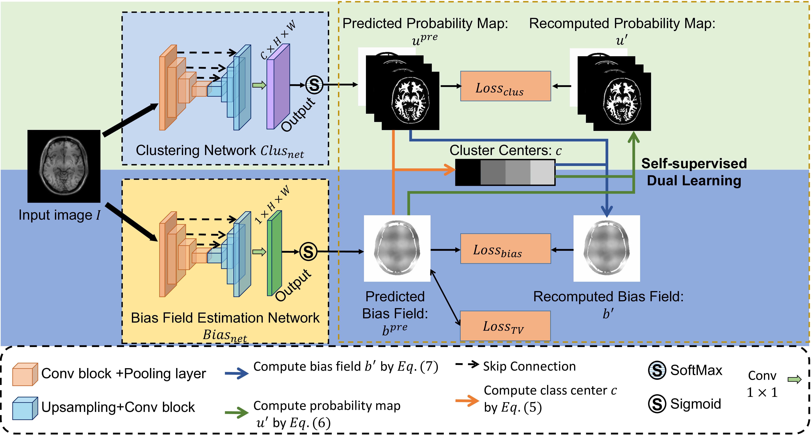
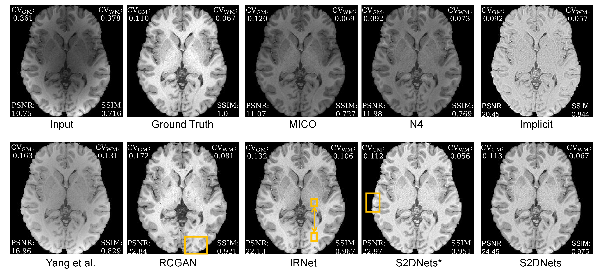

## Structure and Smoothness Constrained Dual Networks for MR Bias Field Correction
[Paper](https://arxiv.org/pdf/2507.01326)  |  [Project](https://github.com/LeongDong/S2DNets/)

[Dong Liang](https://github.com/LeongDong/)<sup>1</sup>, [Xingyu Qiu]<sup>1</sup>, [Yuzhen Li]<sup>1</sup>, [Wei Wang]<sup>1</sup>, [Kuanquan Wang]<sup>1</sup>, [Suyu Dong]<sup>2</sup>, [Gongning Luo]<sup>1, \*</sup>

<sup>1</sup>Harbin Institute of Technology, Harbin<br><sup>2</sup>King Abdullah University of Science and Technology, Saudi Arabia

The framework of S2DNets:
<p align="center">
  
</p>

---

Visual experimental results:
<p align="center">
  
</p>
⭐: If S2DNets is helpful for you, please help star this repo. Thanks!:hugs:

### Requirements
- Pillow 9.4.0
- numpy 1.19.2
- torch 1.13.1 
- matplotlib 3.4.3
- pandas 1.3.5

## <a name="train"></a>:stars:Train
<a name="gen_file_list"></a>
1. Generate file list of training set. For HCP dataset, a file list look like:
   ```
   /train/Corrupted_data/158843_0.png
   /train/Corrupted_data/158843_1.png
   /train/Corrupted_data/158843_2.png
   ...
   ```
   
For BrainWeb dataset, a file lis look like:
   ```
   /train/Corrupted_data/0.png
   /train/Corrupted_data/1.png
   /train/Corrupted_data/2.png
   ...
   ```
2. Set file path in Config.py, i.e. trainDir='/train/'
3. Set save path of [.pth.tar] trained file in Config.py 

Save trained file with minimized bias loss [checkpointBiasGenPath (for bias subnet),checkpointBiasClusPath (for clus subnet)];

Save trained file with minimized clus loss [checkpointClusGenPath (for bias subnet),checkpointClusCluPath (for clus subnet)]

Save latest trained file [checkpointGen (for bias subnet), checkpointGen (for bias subnet)]
4. Set model name, datasetName (BrainWeb or HCP).
5. Start training by train.py

## <a name="test"></a>:stars:Test
1. Set test path by testDir in config.py
2. Set save path for network outputs by saveDir in config.py
3. Start testing by test.py

## Citation
Please cite us if our work is useful for your research.

```
@MICCAI{liang2025S2DNets,
 title{Structure and Smoothness Constrained Dual Networks for MR Bias Field Correction},
 author={Dong Liang and Xingyu Qiu and Yuzhen Li and Wei Wang and Kuanquan Wang and Suyu Dong and Gongning Luo},
 booktitle={International Conference on Medical Image Computing and Computer Assisted Intervention},
 year={2025}
}
```
## License

This project is released under the [Apache 2.0 license](LICENSE).

## Acknowledgement

Thanks for support from Zhou Liang.

## Contact

If you have any questions, please feel free to contact with me at liangton@foxmail.com.
